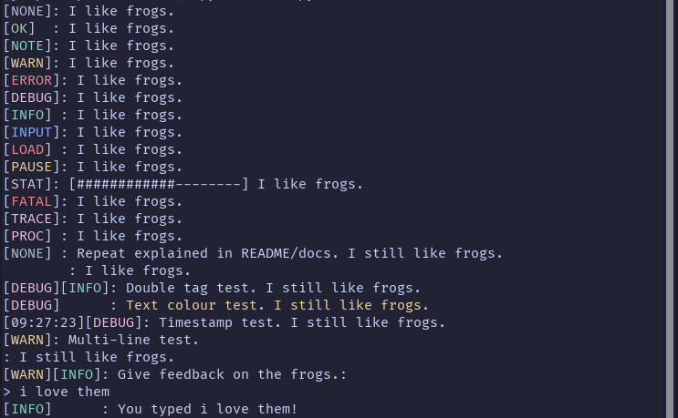

  
  
   
  Cerbose is a simple, cross-platform Python library, mainly for making tagged, colourful console output along with additional features. 
  <a href="https://jasperredis.github.io/cerbose">Website</a> |
  <a href="https://pypi.org/project/cerbose">PyPI</a> |
  <a href="https://jris.straw.page">jasperredis</a> 
  Made by jasperredis [o]:
    
  It is highly reccomended to check <a href="https://jasperredis.github.io/cerbose">the website.</a>

---

> This wasn't done in a codeblock because they can't display colours.

# Functions
## cprint
This is the highlight function of Cerbose. It outputs highly configurable tagged text to the console, and you can configure the following:
- Tag (obviously)
- Text (obviously)
- Logging (enabled, file, and optional feedback)
- Text colour
- Dual tags
- Timestamp (enabled?)
- And more through configuration files.  

It also has a "valonly" mode where it returns the suppposed output instead of printing it.  
More info in [the documentation](docs/DOCS.md).

## mprint
The same as cprint, except it has multiline support.

## cerbar
Returns an ASCII progress bar. You can configure the following:
- Length in characters
- Value being represented (obviously) in regular integers, not percentages.
- Optionally add the percentage represented be before/after the progress bar.
- Optionally add the amount represented (fill/total) before/after the progress bar.
- And more through configuration files.  

More info in [the documentation](docs/DOCS.md).

## cin
Takes user input and returns the input. You can configure the following:
- Prompt (obviously)
- All options for `cprint` in the prompt.
- 'i' and 'o' mode. 'i' allows any text input (remember to set options to 'any'!), and 'o' has a strict set of options.
- Recieving user input as lowercase (enabled?)

More info in [the documentation](docs/DOCS.md).

# Configuration
Cerbose can be more highly configured via config files. As always, [the documentation](docs/DOCS.md) has the best information on this, but here is roughly what you can configure with these:
