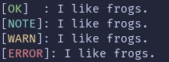

# cprint
`cprint`, the highlight function of Cerbose, allows you to output highly configurable tagged text to the console. Here is a deep overview of how to use it!

`cprint` is defined in Cerbose as:
```python
cprint(type, text, *, logfile=None, logfeedback=False, textcol="normal", stagtype=None, timestamp=False, valonly=False):
```

This means that type and text are the first two required arguments, and the rest are optional keyword arugments.
`type` defines the "tag" the output uses.  

Here is an output of text from Cerbose (examples/test.py)  
  
You should be able to see the parts in brackets. Those are tags.  
Assuming you are using the default configuration, there are 14 of them. That number varies by your configuration, but you will always have at least 1 (if you don't want errors, that is).

Here is a table showing the default configurations of the tags in cprint:

| Input | Text | Colour |
| --- | --- | --- |
| `'none'` | `NONE` | `'white'` |
| `'ok'` | `OK` | `'green'` |
| `'note'` | `NOTE` | `'cyan'` |
| `'warn'` | `WARN` | `'yellow'` |
| `'error'` | `ERROR` | `'red'` |
| `'debug'` | `DEBUG` | `'magenta'` |
| `'info'` | `INFO` | `'cyan'` |
| `'input'` | `INPUT` | `'lightblue'` |
| `'load'` | `LOAD` | `'red'` |
| `'pause'` | `PAUSE` | `'yellow'` |
| `'stat'` | `STAT` | `'magenta'` |
| `'fatal'` | `FATAL` | `'red'` |
| `'trace'` | `TRACE` | `'magenta'` |
| `'proc'` | `PROC` | `'magenta'` |

#### Basic Example
A cprint call, without any additional arguments, is formatted as:
```python
cprint(tag, text)
```

**Example:**
```python
cprint("ok", "I like frogs."
```
Assuming default configurations, the output would look like this:
![`[OK]: I like frogs.`](images/c.png)

#### Logging
Logging in `cprint` is simple.  
Set the `logfile` argument to whatever file you want (e.g., `logfile="log.txt"`), and upon running the `cprint` function, that log file will be created if it doesn't already exist, and the message of the cprint call will be written to it. (assuming no errors occur).  
It will still print the output to the console unless you enable `valonly` (explained later). 

You can also enable `logfeedback` (`logfeedback=True`) to have this output upon the log being written:  
![`[INFO]: Logged last message.`](images/b.png)
> This output is unchanged regardless of configuration.
